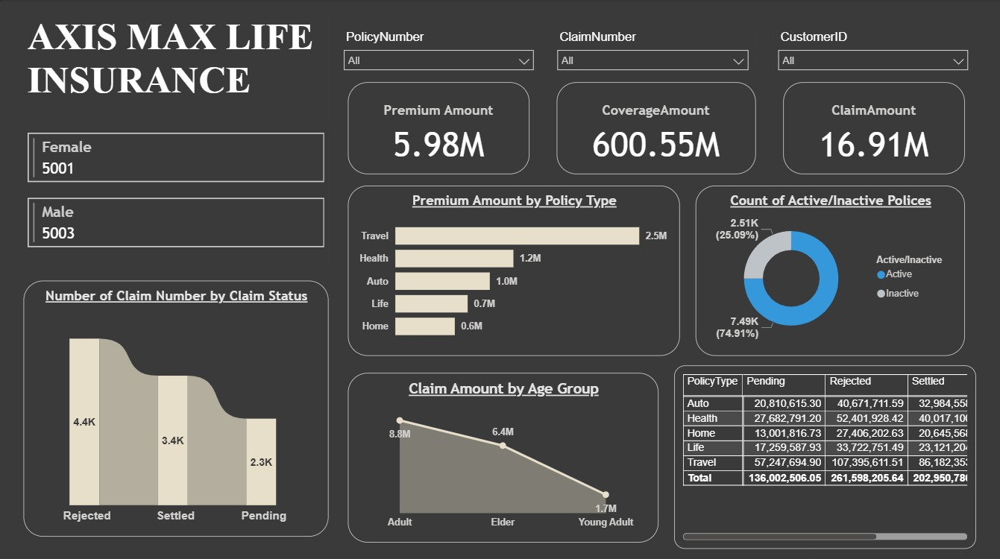

# 📊 Insurance Dashboard (Power BI)

This project is a **Power BI dashboard** built to analyze insurance data, including:

- Premium Amount by Policy Type  
- Claim Amount by Age Group  
- Active vs Inactive Policies  
- Claim Status Distribution  

## 🚀 Features
- Interactive filters by Policy Number, Claim Number, and Customer ID  
- Gender distribution of customers  
- Policy-wise breakdown of premiums and claims  
- Visual insights into claim settlements  

## 🖼️ Dashboard Preview

## 🛠️ Tools Used
- Power BI  
- Data Cleaning & Transformation (Power Query)  

---

✨ Created by [Suraj Pandey](https://github.com/Spcoder13)
